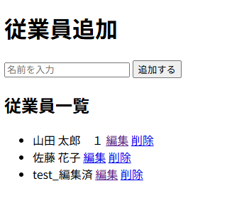

# SaaS-Project-01

## 概要
本プロジェクトは、PHPとDockerを用いたWebアプリケーションです。  
従業員情報のCRUD（作成・読み取り・更新・削除）機能を実装し、コンテナ環境での開発手法とGitによるバージョン管理の習得を目的としています。  
現在はPHPで実装していますが、今後はLaravelフレームワークへのリプレイスを予定しています。

## 動作イメージ

### 一覧表示画面


### 編集画面


## システム構成
Webサーバー層とデータ層を分離した、実務に近いアーキテクチャを採用しています。
* ブラウザ -> HTTP: 8080 -> appコンテナ (PHP 8.2 / Apache)
* appコンテナ -> PDO / MySQL接続 -> dbコンテナ (MySQL 8.0)

※ Web層とデータ層を分離し、疎結合な設計を意識しています。

## 技術的判断

### なぜDockerを使用したか
開発環境と本番環境のOSやミドルウェアの差異による「環境依存のバグ」を排除し、チーム開発における環境構築の再現性を担保するためです。

### なぜMySQLの接続先に `db` を指定したか
Dockerのネットワーク環境下において、`localhost` はPHPコンテナ自体を指してしまいます。コンテナ間通信を行うために、DockerのDNS機能を用いてサービス名 `db` で名前解決を行っています。

## 起動方法 (Quick Start)

1. GitHubからクローン
   ```bash
   git clone [https://github.com/m-kazuha-dev/saas-project-01.git](https://github.com/m-kazuha-dev/saas-project-01.git)
   cd saas-project-01
2. Docker環境のビルドと起動
   ```bash
   docker-compose up -d --build
3. 動作確認
ブラウザで http://localhost:8080/ にアクセスしてください。

## プロジェクト構造
```Plaintext
/saas-project-01
├── docker/
│   └── mysql/
│       └── init.sql         # DB初期化スクリプト
├── src/                     # PHPのソースコード
│   ├── edit.php             # 編集画面
│   ├── index.php            # 一覧・追加・削除処理
│   └── update.php           # 更新処理
├── docker-compose.yml       # Docker構成設定
├── Dockerfile               # コンテナ構築定義
├── .gitignore               # Git管理除外設定
├── README.md                # プロジェクト説明書
└── CHANGELOG.md             # 開発履歴
```
## 開発の目的
現職の税務・基幹システム開発で培った業務ドメイン知識を、モダンなWeb開発技術（PHP/Docker/Laravel）と融合させ、バックオフィス系SaaS企業の即戦力エンジニアへキャリアチェンジすることを目標としています。本プロジェクトはその足がかりとなるポートフォリオです。

開発履歴の詳細は CHANGELOG.md を参照。