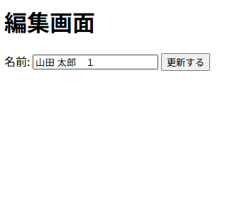

Markdown
# 従業員・給与情報管理システム (HR SaaSモックアップ)

## 概要
本プロジェクトは、バックオフィス系SaaS（HR・給与計算ドメイン）を想定した従業員情報の管理アプリケーションです。
単なるCRUD機能の実装にとどまらず、実際の税務・給与業務で求められる「過去データのエビデンス保持」や「データ不整合の防止」といった要件をDB設計に落とし込んでいます。

現在は、Webアプリケーションの基礎とデータベース操作の仕組みを深く理解するため、あえてピュアPHPで実装しています。
今後は実務を見据え、本システムをベースにした**Laravelフレームワークへのリプレイス**を実施予定です。

## 開発の目的
現職（自治体系の業務SE）の税務・基幹システム保守運用で培った「課税ドメイン知識」と「システム保守の視点」を、モダンなWeb開発技術（PHP/Docker）と融合させ、HR系SaaS企業のエンジニアとして即戦力に近い形で貢献できる基盤を作ることを目標としています。

## 動作イメージ
### 一覧表示画面


### 編集画面


## 起動方法 (Quick Start)
1. GitHubからクローン
   ```bash
   git clone https://github.com/m-kazuha-dev/saas-project-01.git
   ```
2. Docker環境のビルドと起動
   ```bash
   docker-compose up -d --build
   ```
3. 動作確認  
   ブラウザで http://localhost:8080/ にアクセスしてください。

## 本プロジェクトの技術的・業務的なこだわり

### 1. 業務ドメイン知識を反映したDB設計
HR・給与計算システムならではの要件を考慮し、以下の設計を採用しています。
* **論理削除の採用 (`employees.deleted_at`)**
  * 退職等で従業員データが不要になった場合でも、過年度の税額修正や過去の給与計算根拠を遡って確認（エビデンス確認）できるよう、物理削除ではなく論理削除を採用しています。
* **意図的なカスケード削除の非採用 (`salaries`テーブル)**
  * 従業員情報の変更によって、過去の確定した給与支給履歴（＝課税・徴収の根拠データ）が連動して消失するリスクを防ぐため、あえて `ON DELETE CASCADE` は設定しない堅牢な設計としています。

### 2. 再現性とチーム開発を見据えた環境構築・運用
* **Dockerの採用:** 開発環境への依存バグを排除し、チーム開発における環境構築の再現性を担保しています。（App: PHP 8.2/Apache, DB: MySQL 8.0）
* **Git (GitHub Flow) を用いた擬似チーム開発運用:** 常に `main` ブランチへ直接コミットするのではなく、機能ごとにブランチを切り、Pull Requestを作成してマージする、実務を想定したバージョン管理フローを実施しています。

### 3. セキュリティ対策
* **SQLインジェクション対策:** PDOのプリペアドステートメントを用い、悪意のあるSQL実行を防いでいます。
* **XSS対策:** 画面出力時に `htmlspecialchars` を用い、悪意のあるスクリプト実行を無害化しています。

## システム構成/ディレクトリ構造
   ```plaintext
   saas-project-01/
   ├── docker/                 # インフラ環境設定 (PHP, MySQL)
   │   ├── mysql/init.sql      # DB初期化・DDL定義
   │   └── php/Dockerfile
   ├── src/                    # アプリケーションソースコード (ピュアPHP)
   └── docker-compose.yml
   ```

## 今後の展望 (Laravelリプレイス計画)
本プロジェクトを基盤として、より実務に近い以下の技術要素を取り入れていく予定です。
1. **Laravelフレームワークへの移行** (MVCアーキテクチャによる関心の分離)
2. **マイグレーション機能の活用** (チーム開発を見据えたDBスキーマのバージョン管理)
3. **Eloquent ORM / SoftDeletesの導入** (現在の素のPHPでの論理削除ロジックのフレームワークによる自動化・効率化)